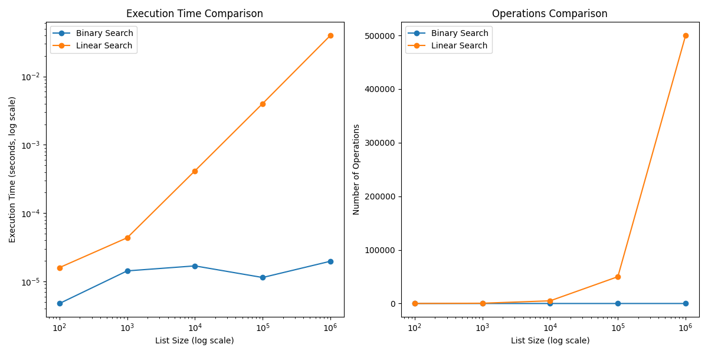

# Comparação de Algoritmos de Busca

Este repositório contém implementações de algoritmos de busca linear e binária, além de uma comparação entre eles em termos de tempo de execução e número de operações realizadas.

## Tecnologias Utilizadas


## Estrutura do Repositório

- `binary_search.py`: Implementação do algoritmo de busca binária.
- `linear_search.py`: Implementação do algoritmo de busca linear.
- `compare_search.py`: Script para comparar o desempenho dos dois algoritmos usando listas de tamanhos variados.
- `busca/search_comparison.png`: Gráfico gerado a partir da comparação de desempenho.

## Gráfico de Comparação



## Algoritmos

### Busca Linear
A busca linear percorre todos os elementos de uma lista, comparando cada um com o item buscado. É simples de implementar, mas pode ser ineficiente para listas grandes.

**Complexidade de Tempo:** O(N)

### Busca Binária
A busca binária exige que a lista esteja ordenada. Ela divide repetidamente a lista pela metade, reduzindo significativamente o número de comparações necessárias.

**Complexidade de Tempo:** O(log N)

## Como Executar os Testes

### Dependências

Este projeto requer as seguintes bibliotecas:

- `matplotlib`: Para gerar gráficos.
- `numpy`: Para manipulação de arrays.

Você pode instalá-las usando pip:

```bash
    pip install matplotlib numpy


1. Clone este repositório:
   git clone https://github.com/Julio-Caio/algoritmos_e_estruturas.git

2. Navegue até o diretório do projeto:
    cd algoritmos_estrutura_dados/python3/busca/

3. Certifique-se de possuir as dependências e execute:
    python3 compare_search.py